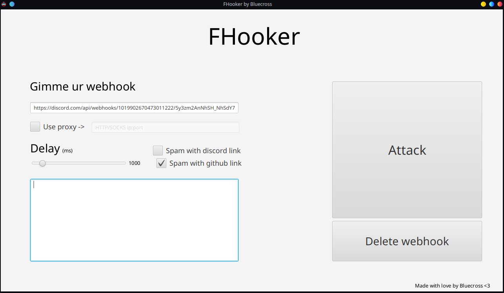

# FHooker
Webhook nuker for Discord
Uses java 11
# Showcase
Client ui:  
 
Spam result: 
 

By the way, Discord blocks requests that are too fast. Therefore, spamming with zero delay will not work. Requests are counted not by IP, but by the webhook link itself, so a proxy will not help here.

for educational purposes only!...  
... you know what i mean 😏

Any ideas here (BBra inc. on top): https://discord.gg/4gUy5CSdkF

P.S.: there is so many shitcode, plz dont watch sources even i dont fully understand why is it works lol